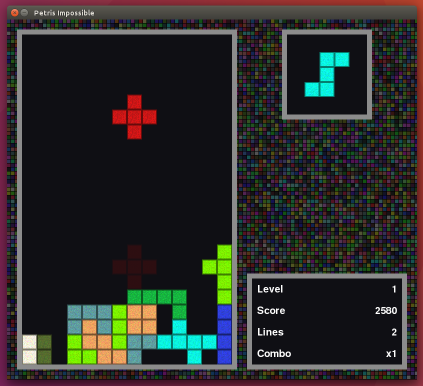

Petris Impossible
======

Petris, including all 12 free pentominoes. Adapted from [MaTris](https://github.com/SmartViking/MaTris). Licensed under the GNU GPLv3. Works with both Python 2 and 3.

Run `python petris.py` to start the game.

Demo
====
